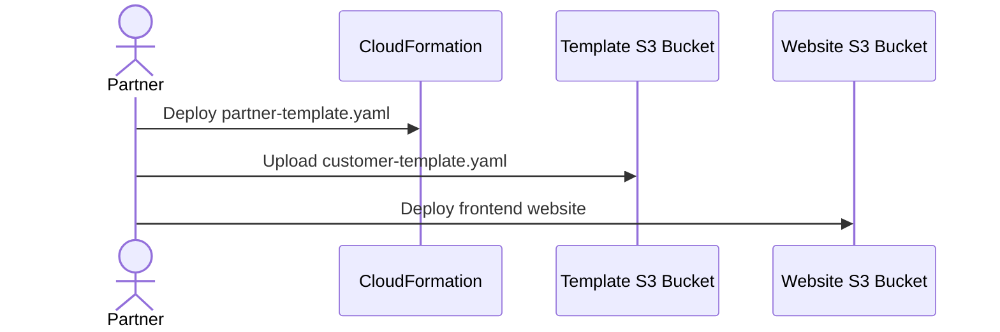
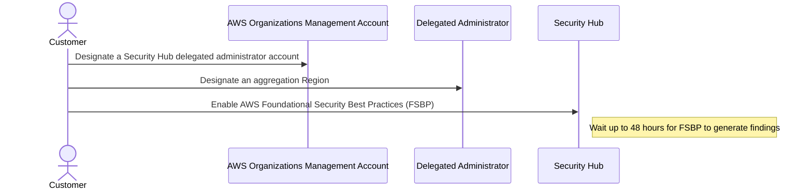
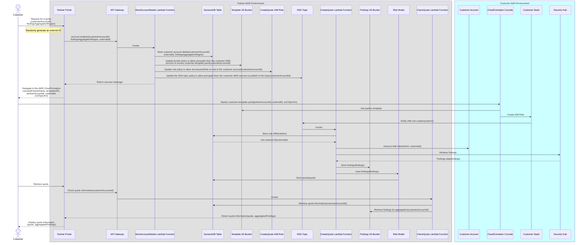
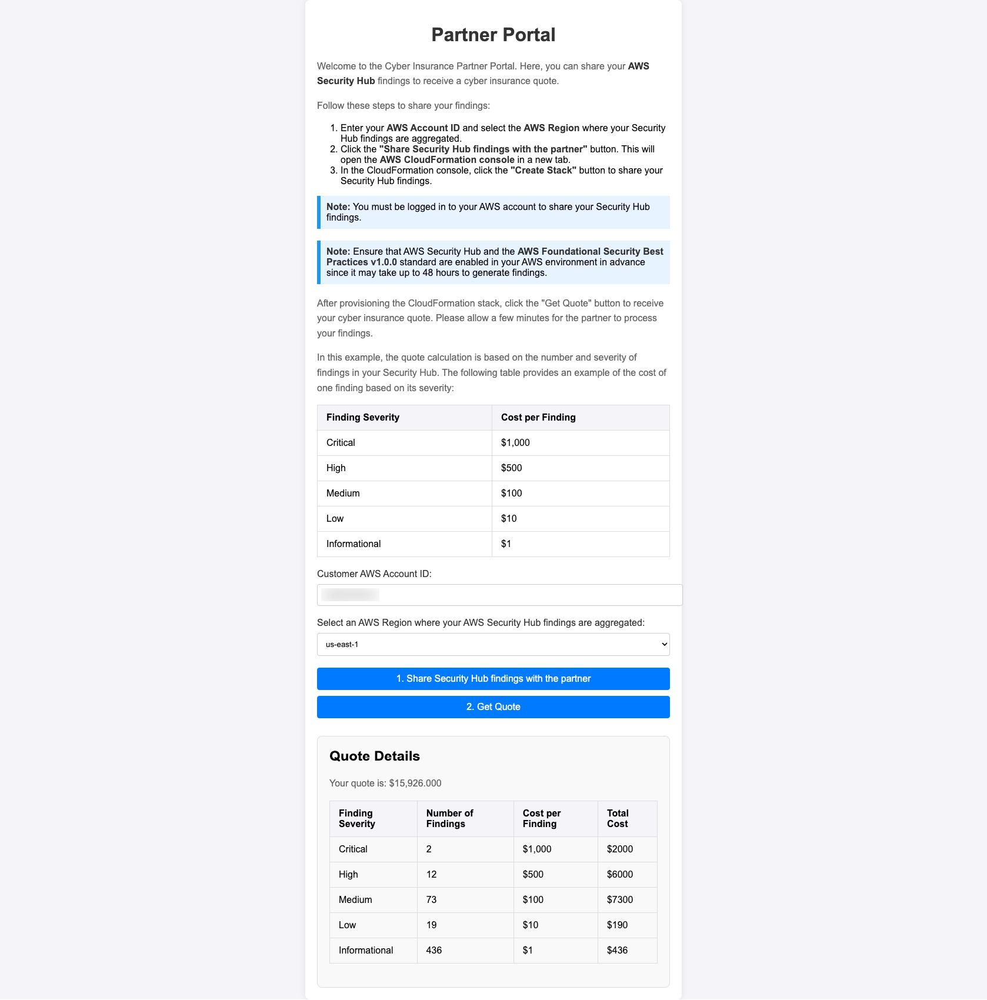

# Cyber Insurance Examples

This repository contains examples of how cyber insurance providers can use AWS services to provide quotes to their customers.

The [AWS Competency Partner Program](https://aws.amazon.com/partners/cyber-insurance-partner-solutions/) is designed to identify, validate, and promote AWS Partners with demonstrated AWS technical expertise and proven customer success. Working with an [AWS Cyber Insurance Partner](https://partners.amazonaws.com/search/partners?facets=Use%20Case%20%3A%20Cyber%20Insurance) is fast and easy. AWS Cyber Insurance Partners have streamlined the process for AWS customers get a quote for the cyber insurance coverage they need within 2 business days. With a simplified method of sharing your AWS security posture by way of AWS Security Hub, AWS Cyber Insurance Partners can offer valuable insights as to how the customer can level up their security posture even higher, thereby further reducing the customer’s business risk while unlocking higher coverage limits or reducing the cost on premiums for the customer.

## Table of Contents

- [Cyber Insurance Examples](#cyber-insurance-examples)
  - [Table of Contents](#table-of-contents)
  - [Solution overview](#solution-overview)
    - [Architecture](#architecture)
    - [Partner Preparation](#partner-preparation)
    - [Customer Preparation](#customer-preparation)
    - [Cyber Insurance Quote Request](#cyber-insurance-quote-request)
    - [Sample Partner Portal](#sample-partner-portal)
    - [Considerations](#considerations)
  - [Deploying the solution](#deploying-the-solution)
    - [Prerequisites](#prerequisites)
    - [Clone the repository](#clone-the-repository)
    - [Deploy the partner stack](#deploy-the-partner-stack)
    - [Uploading the customer template](#uploading-the-customer-template)
    - [Deploying the sample partner portal](#deploying-the-sample-partner-portal)
    - [Cleaning up the solution](#cleaning-up-the-solution)
  - [Content Security Legal Disclaimer](#content-security-legal-disclaimer)

## Solution overview

A customer applying for a cyber insurance quote is expected to enable AWS Security Hub [AWS Foundational Security Best Practices (FSBP) v1.0.0 standard](https://docs.aws.amazon.com/securityhub/latest/userguide/fsbp-standard.html) in AWS accounts across their AWS organization. The findings should be aggregated in a central account and shared with the insurance provider.

This solution automates the process of sharing the Security Hub findings with the insurance provider by using a cross-account IAM role. The customer creates a read-only IAM role in their account that provides the insurance provider with access to the list of Security Hub findings. The insurance provider assumes the IAM role and gets the list of findings related to the `AWS Foundational Security Best Practices v1.0.0 standard`. The findings are used as an input to the risk model to provide a quote.

This approach allows the insurance provider to get the up-to-date data at any time. The customer can revoke the access at any time by deleting the IAM role.

The solution consists of two parts:

1. **Partner**: The partner creates a CloudFormation stack that deploys a website that allows the customer to request a cyber insurance quote and initiate the deployment of the Customer stack (see below). The partner stack also creates an event-driven solution for generating the quote. An Amazon API Gateway endpoint and a few Lambda functions are used to store the customer account details and check if the quote is ready. The stack creates an SNS topic that sends a notification to the partner when the customer stack is deployed. A Lambda function can then assume the IAM role in the customer account and retrieve the Security Hub findings. The findings are stored in an S3 bucket and used as an input to the risk model to provide a quote. The final quote is stored in a DynamoDB table and returned to the customer through the website.
2. **Customer**: The customer deploys a CloudFormation stack that creates a cross-account IAM role providing read-only access to the Security Hub findings. The stack also creates a custom resource that reports back to the partner that the IAM role was successfully created and is ready to use.

### Architecture


### Partner Preparation



### Customer Preparation



### Cyber Insurance Quote Request



### Sample Partner Portal

The partner website allows the customer to request a quote by providing their AWS account ID and region where Security Hub findings are aggregated. It navigates the customer to the AWS CloudFormation console in the customer AWS account to deploy the customer stack. The customer stack creates the IAM role and sends a notification to the partner when the role is ready. The partner solution then retrieves the Security Hub findings and generates the quote which is displayed to the customer on the website. Below is a screenshot of the sample website:



### Considerations

- Transparent approach that allows the customer to review the resources and permissions granted to the insurance provider through the AWS CloudFormation stack deployment.
- Easy for the partner to implement - they just need to assume the IAM role and make a single API call to retrieve the list of Security Hub findings.
- Findings are pulled directly from the customer's account, so the partner does not need to expose any API endpoints to the internet that would require additional security measures.
- No additional cost for the customer beyond the usage of AWS Security Hub.
- The access can be continuously monitored and revoked at any time by the customer. In the PoC, the findings are only pulled once when the customer stack is deployed and the CreateQuote lambda is invoked.
- When the customer revokes the partner's access by deleting the CloudFormation stack, the partner receives an SNS notification and can respond accordingly.
- The partner has access to all Security Hub findings, even though the provided sample code [only filters the findings related to the AWS Foundational Security Best Practices v1.0.0 standard](./src/partner/lambda_functions/create_quote/handler.py#L76-L102). The partner could potentially modify the lambda function to access other types of findings.

## Deploying the solution

### Prerequisites

- AWS CLI configured with appropriate permissions
- Python 3+ installed

### Clone the repository

```bash
git clone https://github.com/aws-samples/cyber-insurance-examples.git
cd cyber-insurance-examples
```

### Deploy the partner stack

1. Install the lambda dependencies:

```bash
pip3 install -r src/partner/lambda_functions/create_quote/requirements.txt -t src/partner/lambda_functions/create_quote/
```

2. Create a deployment S3 bucket. Make sure to use the unique bucket name:

```bash
BUCKET_NAME="deployment-bucket-cyberinsurance-demo-$(date +%s)"
REGION=us-east-1

if aws s3api head-bucket --bucket $BUCKET_NAME 2>/dev/null; then
    echo "Bucket $BUCKET_NAME already exists"
else
    if [ "$REGION"=="us-east-1" ]; then
        aws s3api create-bucket --bucket $BUCKET_NAME --region $REGION && echo "Bucket $BUCKET_NAME created successfully"
    else
        aws s3api create-bucket --bucket $BUCKET_NAME --region $REGION --create-bucket-configuration LocationConstraint=$REGION && echo "Bucket $BUCKET_NAME created successfully"
    fi
fi
```

3. Package and deploy the CloudFormation template:

```bash
STACK_NAME=partner-stack

aws cloudformation package \
    --template-file src/partner/partner-template.yaml \
    --s3-bucket $BUCKET_NAME \
    --output-template-file src/partner/packaged-partner-template.yaml \
    --region $REGION &&

aws cloudformation deploy \
    --stack-name $STACK_NAME \
    --template-file src/partner/packaged-partner-template.yaml \
    --s3-bucket $BUCKET_NAME \
    --region $REGION \
    --capabilities CAPABILITY_NAMED_IAM
```

### Uploading the customer template

Upload [customer-template.yaml](./src/customer/customer-template.yaml) to the Website S3 bucket.

```bash
export WEBSITE_BUCKET_NAME=$(aws cloudformation describe-stacks --region $REGION --stack-name $STACK_NAME --query "Stacks[0].Outputs[?OutputKey=='WebsiteBucketName'].OutputValue" --output text)

aws s3 cp src/customer/customer-template.yaml s3://$WEBSITE_BUCKET_NAME/
```

### Deploying the sample partner portal

1. Update the variables in the [config.js](./src/partner/config.js):
   1. `partnerName` - business name of the company
   2. `partnerAccountId` - AWS account ID running the cyber isnurance quote workload
   3. `templateURL` - the URL of the [customer-template.yaml](./src/customer/customer-template.yaml) file in the Website S3 bucket
   4. `snsTopicArn` - the ARN of the SNS topic created by the `partner-stack` CloudFormation stack. Available in the `SNSTopicARN` output of the `partner-stack` CloudFormation stack
   5. `apiURL` - the URL of the API Gateway endpoint created by the `partner-stack` CloudFormation stack. Available in the `ApiGatewayURL` output of the `partner-stack` CloudFormation stack

2. Upload [index.html](./src/partner/index.html) and [config.js](./src/partner/config.js) to the Website S3 bucket.

```bash
aws s3 cp src/partner/index.html s3://$WEBSITE_BUCKET_NAME/
aws s3 cp src/partner/config.js s3://$WEBSITE_BUCKET_NAME/
```

3. Open the website URL in the browser. The URL can be found in the `WebsiteURL` output of the CloudFormation stack.

```bash
export WEBSITE_URL=$(aws cloudformation describe-stacks --region $REGION --stack-name $STACK_NAME --query "Stacks[0].Outputs[?OutputKey=='WebsiteURL'].OutputValue" --output text)
echo $WEBSITE_URL
```

### Cleaning up the solution

1. Empty the Website S3, Secury Hub findings, and deployment S3 buckets:

```bash
export SECURITY_HUB_FINDINGS_BUCKET_NAME=$(aws cloudformation describe-stacks --region $REGION --stack-name $STACK_NAME --query "Stacks[0].Outputs[?OutputKey=='SecurityHubBucketName'].OutputValue" --output text)
for BUCKET in $WEBSITE_BUCKET_NAME $SECURITY_HUB_FINDINGS_BUCKET_NAME $BUCKET_NAME; do
    if aws s3api head-bucket --bucket $BUCKET 2>/dev/null; then
        aws s3 rm s3://$BUCKET/ --recursive && echo "Objects removed from $BUCKET"
    else
        echo "Bucket $BUCKET does not exist"
    fi
done
```

2. Delete the CloudFormation stack:

```bash
aws cloudformation delete-stack --region $REGION --stack-name $STACK_NAME
```

## Content Security Legal Disclaimer

Sample code, software libraries, command line tools, proofs of concept, templates, or other related technology are provided as AWS Content or Third-Party Content under the AWS Customer Agreement, or the relevant written agreement between you and AWS (whichever applies). You should not use this AWS Content or Third-Party Content in your production accounts, or on production or other critical data. You are responsible for testing, securing, and optimizing the AWS Content or Third-Party Content, such as sample code, as appropriate for production grade use based on your specific quality control practices and standards. Deploying AWS Content or Third-Party Content may incur AWS charges for creating or using AWS chargeable resources, such as running Amazon EC2 instances or using Amazon S3 storage.
