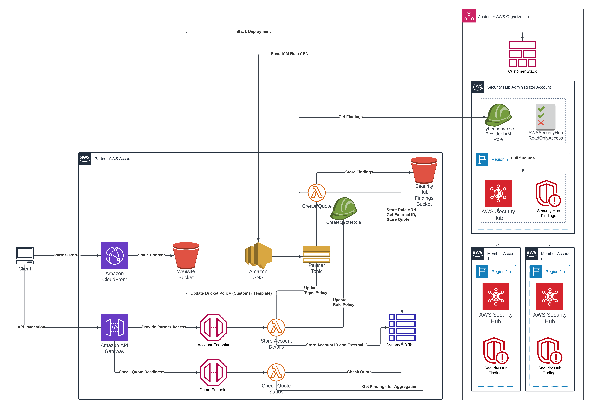

# Cyber Insurance Examples

## AWS IAM Role Approach

### Solution overview

When a customer wants to receive a quote from a cyber insurance provider partner, a customer is expected:

1. Enable AWS Security Hub `AWS Foundational Security Best Practices v1.0.0` standard in their AWS account/AWS organization
2. Create an AWS IAM role that provides the partner with access to the list of Security Hub findings in customer's account
3. Share the created IAM role ARN with the partner

The partner assumes the provided IAM role and gets only findings related to the `AWS Foundational Security Best Practices v1.0.0 standard` (please see the [sample lambda function code](./src/partner/lambda_functions/create_quote/handler.py#L78-L85)).



#### Pros

- Easy to deploy by a customer - a CloudFormation stack that deploys just one IAM role
- Easy to implement by a partner - need to 1/ assume the IAM role and 2/ run a single API call to get the list of Security Hub findings
- Findings are pulled from customer's account. The partner does not have to expose any API endpoints to the Internet that increase the attack surface and need to be properly secured (i.e., authentication, authorization, input data validation, etc.)
- No cost for a customer other than costs associated with usage of AWS Security Hub
- Continuous integration, access can be revoked at any time. In the implemented PoC, the findings are pulled only once when the customer stack is deployed and the CreateQuote lambda is invoked by the SNS Topic (via a custom resource in the customer stack)
- When a customer removes the CloudFormation stack, the partner receives an SNS notification and can react accordingly

#### Cons

- Partners have access to all Security Hub findings. Although the provided [sample lambda function code](./src/partner/lambda_functions/create_quote/handler.py#L78-L85) filters only the findings related to the `AWS Foundational Security Best Practices v1.0.0 standard` on the request level, the lambda can be modified by the partner to get access to other findings as well

### Deploying the solution

1. Install lambda dependencies:

```bash
pip install -r src/partner/lambda_functions/create_quote/requirements.txt -t src/partner/lambda_functions/create_quote/
```

2. Create a deployment S3 bucket. Make sure to use the unique bucket name:

```bash
BUCKET_NAME="deployment-bucket-cyberinsurance-demo-$(date +%s)"
REGION=us-east-1

if aws s3api head-bucket --bucket $BUCKET_NAME 2>/dev/null; then
    echo "Bucket $BUCKET_NAME already exists"
else
    if [ "$REGION"=="us-east-1" ]; then
        aws s3api create-bucket --bucket $BUCKET_NAME --region $REGION && echo "Bucket $BUCKET_NAME created successfully"
    else
        aws s3api create-bucket --bucket $BUCKET_NAME --region $REGION --create-bucket-configuration LocationConstraint=$REGION && echo "Bucket $BUCKET_NAME created successfully"
    fi
fi
```

3. Package and deploy the CloudFormation template:

```bash
STACK_NAME=partner-stack

aws cloudformation package \
    --template-file src/partner/partner-template.yaml \
    --s3-bucket $BUCKET_NAME \
    --output-template-file src/partner/packaged-partner-template.yaml \
    --region $REGION &&

aws cloudformation deploy \
    --stack-name $STACK_NAME \
    --template-file src/partner/packaged-partner-template.yaml \
    --s3-bucket $BUCKET_NAME \
    --region $REGION \
    --capabilities CAPABILITY_NAMED_IAM
```

4. Upload [customer-template.yaml](./src/customer/customer-template.yaml) to the Website S3 bucket.

```bash
export WEBSITE_BUCKET_NAME=$(aws cloudformation describe-stacks --region $REGION --stack-name $STACK_NAME --query "Stacks[0].Outputs[?OutputKey=='WebsiteBucketName'].OutputValue" --output text)
aws s3 cp src/customer/customer-template.yaml s3://$WEBSITE_BUCKET_NAME/
```

5. Update the variables in the [config.js](./src/partner/config.js):
   1. `partnerName` - business name of the company
   2. `partnerAccountId` - AWS account ID running the cyber isnurance quote workload
   3. `templateURL` - the URL of the [customer-template.yaml](./src/customer/customer-template.yaml) file in the Website S3 bucket
   4. `snsTopicArn` - the ARN of the SNS topic created by the `partner-stack` CloudFormation stack. Available in the `SNSTopicARN` output of the `partner-stack` CloudFormation stack
   5. `apiURL` - the URL of the API Gateway endpoint created by the `partner-stack` CloudFormation stack. Available in the `ApiGatewayURL` output of the `partner-stack` CloudFormation stack

6. Upload [index.html](./src/partner/index.html) and [config.js](./src/partner/config.js) to the Website S3 bucket.

```bash
aws s3 cp src/partner/index.html s3://$WEBSITE_BUCKET_NAME/
aws s3 cp src/partner/config.js s3://$WEBSITE_BUCKET_NAME/
```

7. Open the website URL in the browser. The URL can be found in the `WebsiteURL` output of the CloudFormation stack.

```bash
export WEBSITE_URL=$(aws cloudformation describe-stacks --region $REGION --stack-name $STACK_NAME --query "Stacks[0].Outputs[?OutputKey=='WebsiteURL'].OutputValue" --output text)
echo $WEBSITE_URL
```

### Cleaning up the solution

1. Empty the Website S3, Secury Hub findings, and deployment S3 buckets:

```bash
export SECURITY_HUB_FINDINGS_BUCKET_NAME=$(aws cloudformation describe-stacks --region $REGION --stack-name $STACK_NAME --query "Stacks[0].Outputs[?OutputKey=='SecurityHubBucketName'].OutputValue" --output text)
for BUCKET in $WEBSITE_BUCKET_NAME $SECURITY_HUB_FINDINGS_BUCKET_NAME $BUCKET_NAME; do
    if aws s3api head-bucket --bucket $BUCKET 2>/dev/null; then
        aws s3 rm s3://$BUCKET/ --recursive && echo "Objects removed from $BUCKET"
    else
        echo "Bucket $BUCKET does not exist"
    fi
done
```

2. Delete the CloudFormation stack:

```bash
aws cloudformation delete-stack --region $REGION --stack-name $STACK_NAME
```

## Content Security Legal Disclaimer

Sample code, software libraries, command line tools, proofs of concept, templates, or other related technology are provided as AWS Content or Third-Party Content under the AWS Customer Agreement, or the relevant written agreement between you and AWS (whichever applies). You should not use this AWS Content or Third-Party Content in your production accounts, or on production or other critical data. You are responsible for testing, securing, and optimizing the AWS Content or Third-Party Content, such as sample code, as appropriate for production grade use based on your specific quality control practices and standards. Deploying AWS Content or Third-Party Content may incur AWS charges for creating or using AWS chargeable resources, such as running Amazon EC2 instances or using Amazon S3 storage.
